### 第一步：安装Anaconda

#### 1.下载Anaconda安装包

Anaconda官网[Anaconda官网](https://www.anaconda.com/)

Anaconda清华镜像网[Anaconda清华镜像网](https://mirrors.tuna.tsinghua.edu.cn/anaconda/archive/)

这里有许多版本，本系统选择下载2024.06-1版本，大家根据需求选择即可。

#### 2.安装Anaconda

打开刚刚下载好的安装包，双击运行。

选择安装路径时最好选择自己的路径（默认安装是安装在C盘）。

前面我们一直确认next即可，直到这里我们选择all user。

这里我们只选择第二个，默认带一个**python3.12**环境。

| 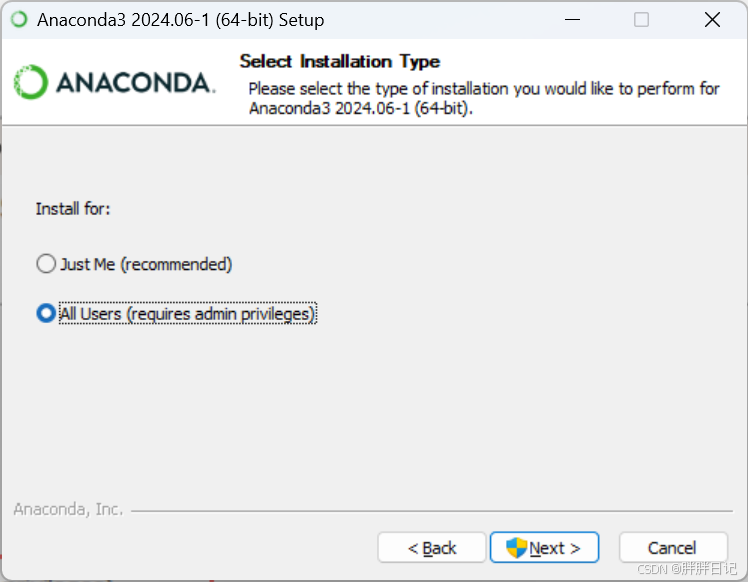 | 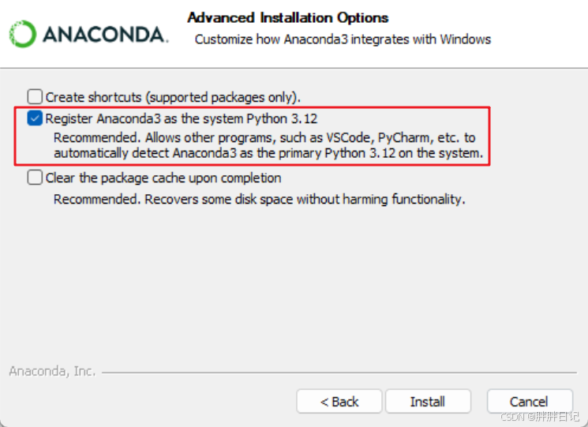 |
| :--------------------------------------------------: | ---------------------------------------------------- |

然后等待安装即可，安装文件有几GB，**时间会可能会比较久，因各自电脑配置而异，耐心等待即可。**

#### 3.配置环境变量

打开设置，搜索 **“查看高级系统设置”，** 点击打开。

打开环境变量。

在系统变量中，找到变量path。

双击打开，右键新建。

新建五个变量进去，将下面的五个变量的结合你的anaconda实际安装目录来更改写入。

```
D:\Anaconda3
D:\Anaconda3\Scripts
D:\Anaconda3\Library\bin
D:\Anaconda3\Library\mingw-w64\bin
D:\Anaconda3\Library\usr\bin
```

添加结束， **右下角确认退出** 。

#### 4.检查是否安装成功

按下Win+R，输入cmd打开终端。

输入命令检验 `conda --version`，**检验anaconda版本。**

#### 5.更改镜像源

切记，更改镜像源需要在系统环境，如果第四步进入了python环境，需要先输入exit退出，或者重新打开一个终端更改镜像源。

直接输入以下命令即可，将默认的国外站点更改为国内的镜像源，速度更快！

```
conda config --add channels https://mirrors.tuna.tsinghua.edu.cn/anaconda/pkgs/free/
conda config --add channels https://mirrors.tuna.tsinghua.edu.cn/anaconda/cloud/conda-forge
conda config --add channels https://mirrors.tuna.tsinghua.edu.cn/anaconda/cloud/msys2/
//设置搜索时显示通道地址
conda config --set show_channel_urls yes
```

### 第二步：创建Pytorch环境

#### 1.查看显卡驱动

输入命令 `nvidia-smi`，查看对应的版本。

Pytorch官网下载命令获取：[Pytorch](https://pytorch.org/get-started/previous-versions/)

#### 2.安装虚拟环境

打开Anaconda命令行,输入：

```
conda create -n nerf python=3.7.12
```

然后激活刚刚创建好的pytroch1环境，命令如下：

```
conda activate nerf
pip install -r requirements.txt
```

本次安装依据以下代码：

```
# CUDA 10.2 
conda install pytorch==1.12.1 torchvision==0.13.1 torchaudio==0.12.1 cudatoolkit=10.2 -c pytorch 
# CUDA 11.3 
conda install pytorch==1.12.1 torchvision==0.13.1 torchaudio==0.12.1 cudatoolkit=11.3 -c pytorch 
# CUDA 11.6 
conda install pytorch==1.12.1 torchvision==0.13.1 torchaudio==0.12.1 cudatoolkit=11.6 -c pytorch -c conda-forge
# CPU Only
conda install pytorch==1.12.1 torchvision==0.13.1 torchaudio==0.12.1 cpuonly -c pytorch
```

### 第三步：创建Tensorflow环境

```
conda create -n tensorflow python=3.7
conda activate tensorflow
pip install -r requirements.txt
pip install tensorflow_gpu==1.15.0 -i https://pypi.douban.com/simple
pip install tensorflow_probability==0.8.0 -i https://pypi.douban.com/simple
pip install tensorflow_datasets==1.3.0 -i https://pypi.douban.com/simple
```

### 第四步：安装COLMAP

windows环境colmap安装，Colmap按照官网的编译方式需要预装好CMake,[B](https://so.csdn.net/so/search?q=Boost&spm=1001.2101.3001.7020 "Boost")oost,QT5,CUDA和CGAL

#### 1.cmake

CMake 官方下载网址：[CMake](https://cmake.org/download/)

点击下载 cmake-3.27.2-win64-x64.msi

运行安装文件，一直点击Next，环境变量一页按照图片选择。

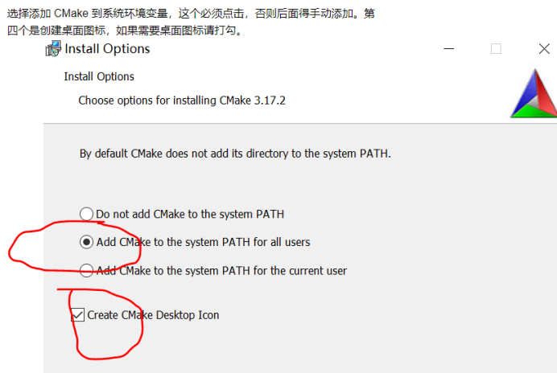

在进入cmd的界面中输入 `cmake --version`

环境变量如下：

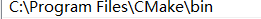

#### 2.Boost

Boost官方下载网址：[Boost](https://www.boost.org/)

选择一个版本下载到本地即可，双击bootstrap.bat文件生成b2.exe。

执行结束后，会在当前目录下生成 b2.exe 文件。然后双击执行该可执行文件，并等待其执行结束。

文件夹中一定要有对应版本的lib库，并添加环境变量：


#### 3.QT5

这里安装Qt5.14.2（因为从Qt5.15.0起， 对于开源用户，Qt官方不再提供独立安装文件，所以源码安装太麻烦）

下载链接：[QT5](https://download.qt.io/archive/qt/5.14/5.14.2/)

点击qt-opensouce-windows-86-5.14.2下载，下载好直接点击，运行可以断网跳过注册，推荐注册。

选择组件可以参考以下：

|  | 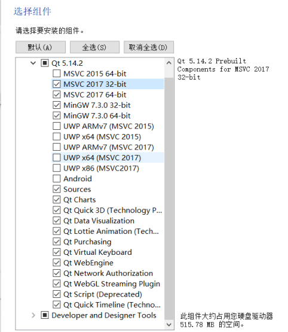 |
| ---------------------------------------------------- | ---------------------------------------------------- |

添加环境变量：

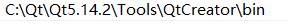

#### 4.CUDA

安装CUDA的教程很多，一般带有显卡的会自带有CUDA，这里不再赘述。COLMAP的CUDA按照官网的说法是可选择的安装。

#### 5.CGAL

CGAL官网下载页面：[CGAL]([https://www.cgal.org/download/windows.html]())

下载红色框框圈住的两个文件，上面的那个就是必要的依赖项。

将CGAL-5.2.1.zip解压到 D:\dev 文件夹下，将GMP and MPFR libraries解压后的gmp文件夹复制到 D:\dev\CGAL-5.2.1\auxiliary 文件夹中。

| 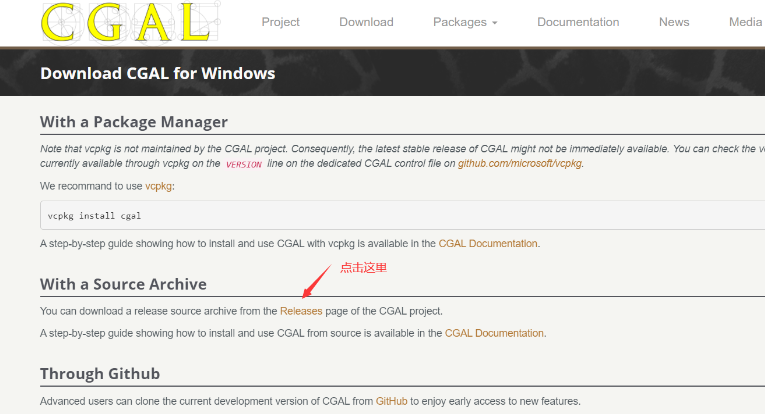 | 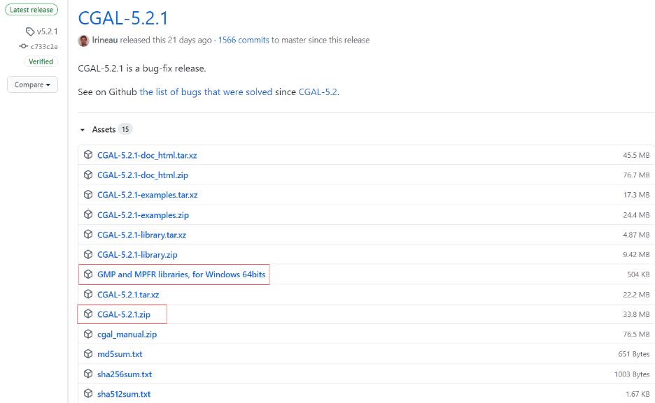 |
| :--------------------------------------------------: | ---------------------------------------------------- |
|  | 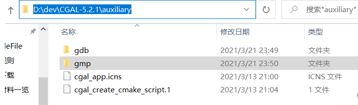 |

添加环境变量：

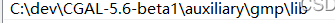

#### 6.COLMAP安装

上述依赖安装完毕后就可以开始编译colmap了。

编译前检查一下环境变量是否都有了：

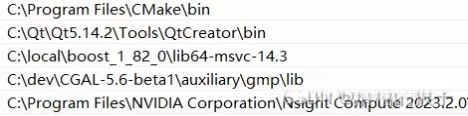

colmap下载链接：[COLMAP](https://github.com/colmap/colmap/releases)

这里下载编译的是dev版本，下载完是一个压缩包，解压到自己想放的文件目录即可。

编译推荐官网的python脚本编译方式，因为这种编译方式会帮你自动下载需要的依赖库，比自己用CMake方便很多。

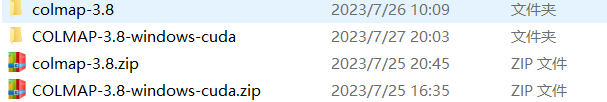

打开cmd指令窗口，输入：

```
Python C:\Users\86130\Desktop\COLMAP-3.8-windows-cuda\colmap-3.8\scripts\python\build.py
 --build_path C:\Users\86130\Desktop\COLMAP-3.8-windows-cuda\colmap-3.8\build
 --colmap_path C:\Users\86130\Desktop\COLMAP-3.8-windows-cuda\colmap-3.8
 --boost_path "C:/local/boost_1_82_0/lib64-msvc-14.3"
 --qt_path "C:\Qt\Qt5.14.2\5.14.2\msvc2017_64"
 --cuda_path "C:\Program Files\NVIDIA GPU Computing Toolkit\CUDA\v12.2"
```

### 第五步：安装ImageMagick

下载页面地址：[ImageMagic](https://imagemagick.org/script/download.php#windows)

会进入到页面的**Windows Binary Release**部分。

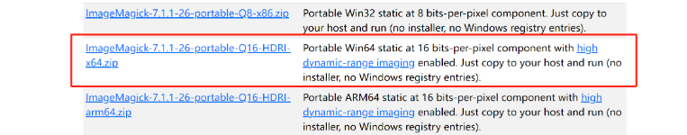

这种方法无需安装程序，也无需 Windows 注册表项。

这里要注意一个小坑，这个压缩包居然没有父文件夹，解压后会所有的exe文件直接全蹦出来，建议解压选择解压到某某目录下。

下载压缩包后，放在本地解压即可，将解压后的文件放到自定义目录。

例如放到C:\App\ImageMagick下。那么将`C:\App\ImageMagick`配置到path环境变量就算安装完成。

打开一个cmd面板输入下面的指令即可验证安装是否成功。

```
magick logo: logo.gif
magick identify logo.gif
magick logo.gif win:
```

### 第六步：数据位姿提取

在进行特征提取时候记得选择相机**模型**，最好不要使用默认的，选择SIMPLE——PINHOLE和PINHOLE均可。

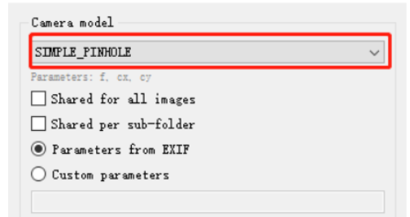

结束后点击关闭，接着点击Processing下面的Feature matching，再点击Run即可，然后等待匹配结束。

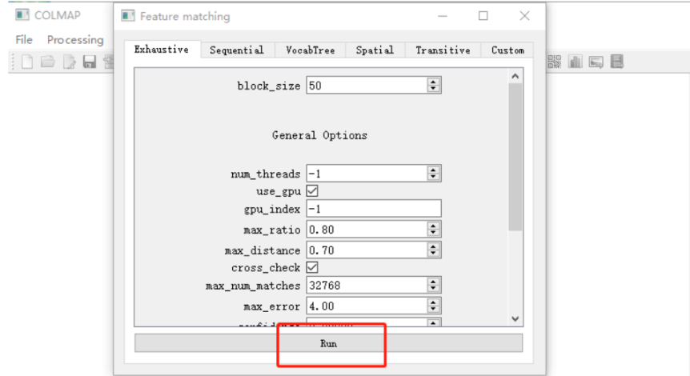

结束后点击Processing旁边的Reconstruction，选择Start Reconstruction，等待结束。

在完成这一步后我们最好查看一下是否每一张图片都被匹配到了，可能会出现没重建上的情况，这些图片要留意，后面我们要删除。

结束后，点击File，选择Export model，这里一定注意不要直接保存，需要新建两个文件夹（sparse,0），请保持一致 nerf原代码中固定了sparse/0文件夹的名称。

架构可以参考下面图片：

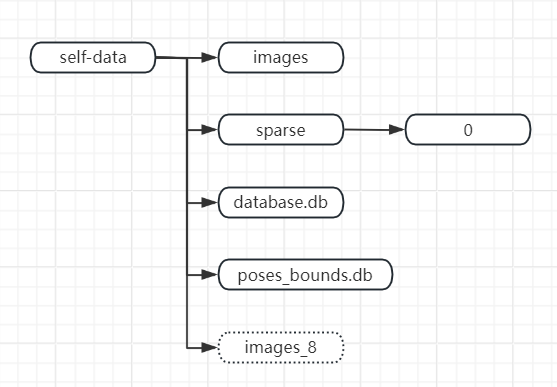

### 第七步：NPY文件转换

将第六步的文件夹直接放入LLFF-master，编译器终端进入tensorflow环境：

```
conda activate tensorflow
cd LLFF-master
python imgs2poses.py <your_scenedir>
cd ..
```

### 第八步：启动界面文件

编译器终端进入nerf环境：

```
conda activate nerf
python nui.py
```
